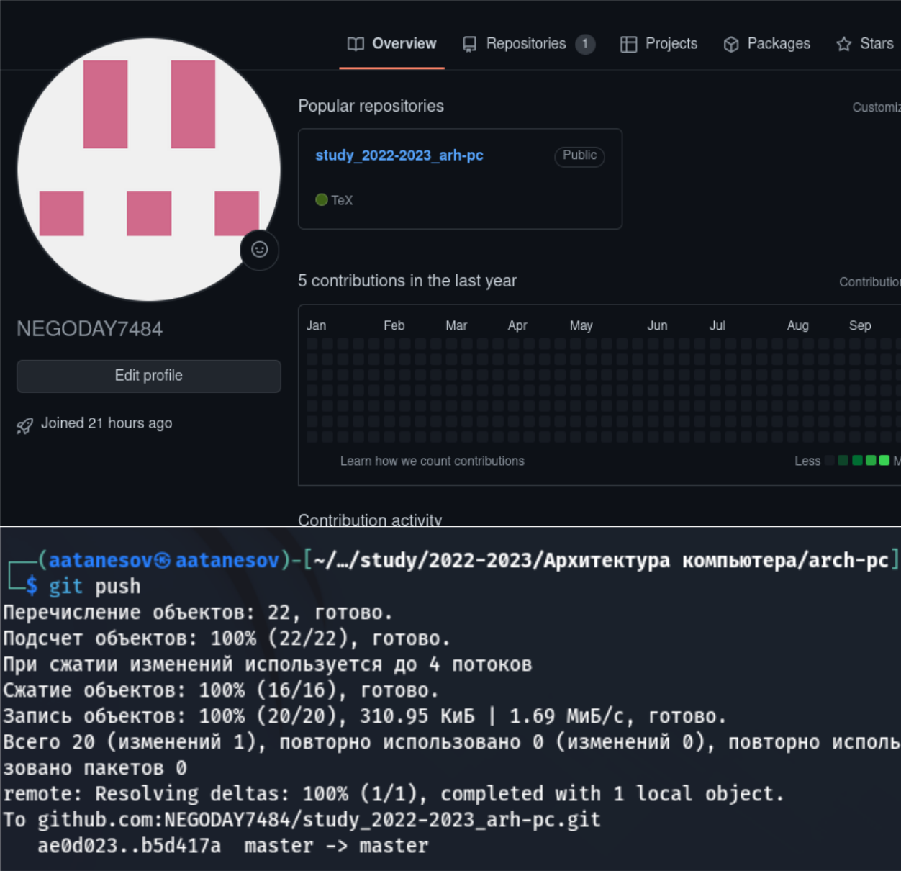
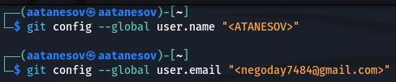
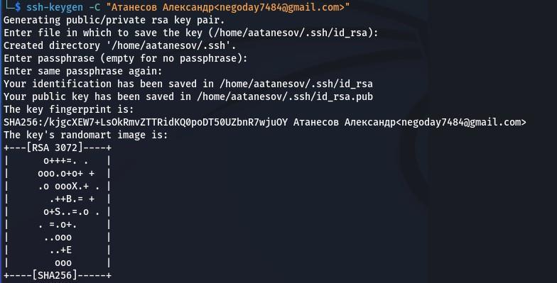
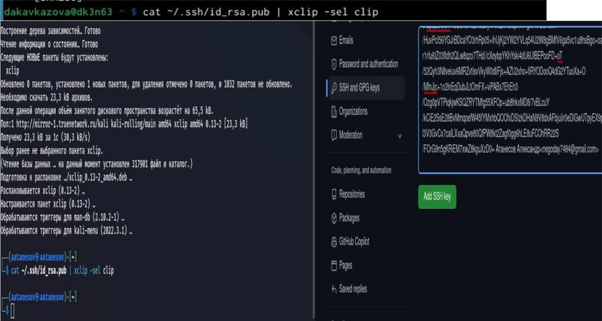
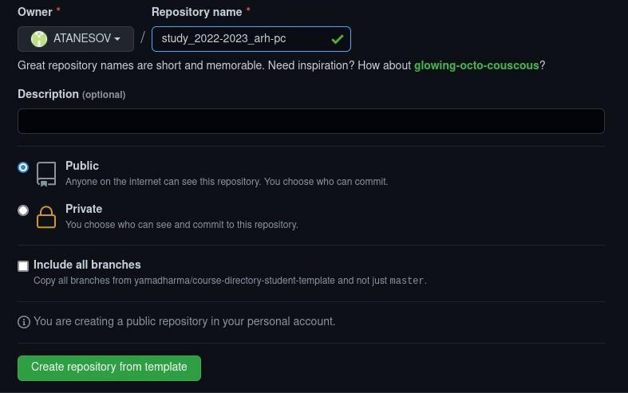
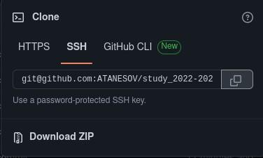
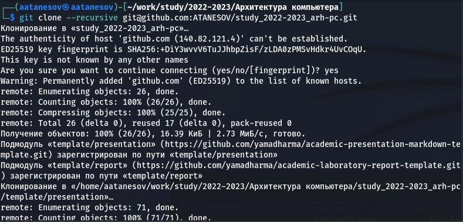
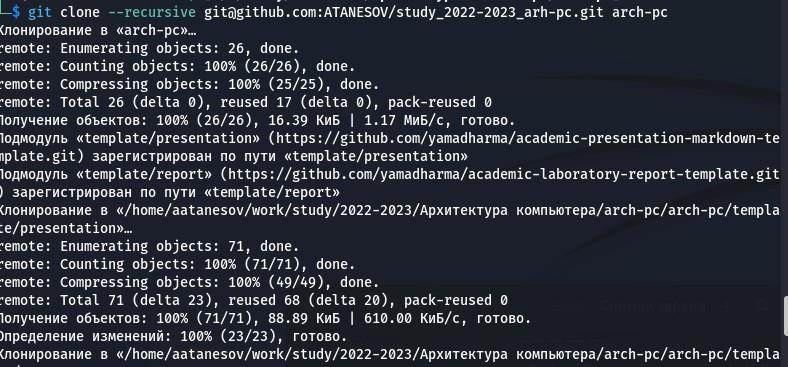
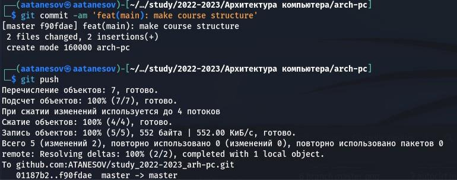
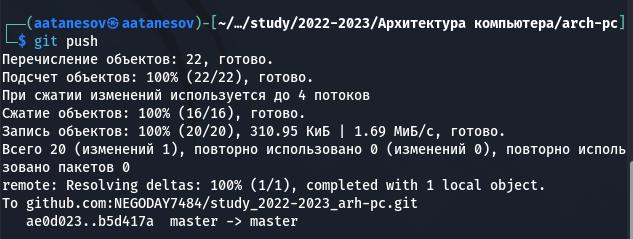

---
## Front matter
title: "Лабораторная работа №2"
subtitle: "Архитектура вычислительных систем"
author: "Атанесов Александр"

## Generic otions
lang: ru-RU
toc-title: "Содержание"

## Bibliography
bibliography: bib/cite.bib
csl: pandoc/csl/gost-r-7-0-5-2008-numeric.csl

## Pdf output format
toc: true # Table of contents
toc-depth: 2
lof: true # List of figures

fontsize: 12pt
linestretch: 1.5
papersize: a4
documentclass: scrreprt
## I18n polyglossia
polyglossia-lang:
  name: russian
  options:
	- spelling=modern
	- babelshorthands=true
polyglossia-otherlangs:
  name: english
## I18n babel
babel-lang: russian
babel-otherlangs: english
## Fonts
mainfont: PT Serif
romanfont: PT Serif
sansfont: PT Sans
monofont: PT Mono
mainfontoptions: Ligatures=TeX
romanfontoptions: Ligatures=TeX
sansfontoptions: Ligatures=TeX,Scale=MatchLowercase
monofontoptions: Scale=MatchLowercase,Scale=0.9
## Biblatex
biblatex: true
biblio-style: "gost-numeric"
biblatexoptions:
  - parentracker=true
  - backend=biber
  - hyperref=auto
  - language=auto
  - autolang=other*
  - citestyle=gost-numeric
## Pandoc-crossref LaTeX customization
figureTitle: "Рис."
tableTitle: "Таблица"
listingTitle: "Листинг"
lofTitle: "Список иллюстраций"
lolTitle: "Листинги"
## Misc options
indent: true
header-includes:
  - \usepackage{indentfirst}
  - \usepackage{float} # keep figures where there are in the text
  - \floatplacement{figure}{H} # keep figures where there are in the text
---

# Цель работы
изучение идеологии системы контроля версий git и
их применение.
Приобретение практических навыков по работе с системой git

# Задание

Создать отчет по выполнению Лабораторной работы в соответствующем каталоге рабочего пространства (labs/lab03/report) 

# Выполнение лабораторной работы

1)**Настройка Github:**

Для выполнения работы используем сайт <https://github.com/> и создаём
учётную запись, введя личные данные (имя , фамилию ,адрес электронной
почты).

{ #fig:001 width=90% }

2)  **Базовая настройка github:**

Сначала зададим **git** (совокупность настроек программы, задаваемая
пользователем, а также процесс изменения этих настроек в соответствии с
нуждами пользователя).

Открываем терминал и вводим следующие команды, указав своё имя и email:

{ #fig:002 width=90% }

**git config** --- это функция, которая позволяет настраивать значения
**github** на глобальном и локальном уровнях проекта. При выполнении
команды **git config** происходит изменение текстового файла. Задаём к
этой команде, команду **\--** **global** для того чтобы **Github**
использовал наши данные и в будущем

3)  Введём параметр **utf-8**(чтобы русские символы были читаемы,к ним
    нужно приписать параметр **quotepath** в секции \[core\], установив
    его в **false**):

4)  Зададим начальную ветку **master**:

5)  Параметр **autocrlf(параметр изменения текста)** :

6)  Параметр **safecrlf** (проверит, можно ли будет откатить изменения и
    предупредит в случае неудачной операции. ):

{ #fig:003 width=90% }

7)  Создание **SSH** ключа:

Для последующей идентификации пользователя на сервере репозиториев
сгенерируем пару ключей (приватный и открытый): с помощью команды

**ssh-keygen -C \"Имя Фамилия \<work\@mail\>\"**

{ #fig:008 width=90% }

8)  Введём сгенерированный открытый ключ под своей учётной записью,

зайдя на сайт: [**http://github.org/**](http://github.org/) и перейдём в
меню **Setting**. Псоле этого выберем в боковом меню вкладку **SSH and
GPG keys** и нажмём кнопку **New SSH key**.Коппируем из локальной
консоли ключ в буфер обмена коммандой: **cat \~/.ssh/id_rsa.pub \| xclip
-sel clip** , вставим ключ в появившееся поле и укажем имя **Title**.

{{ #fig:009 width=90% }}

9)  **Создание рабочего пространства и репозитория курса на основе
    шаблона** В терминале создадим каталог для предмета «Архитектура
    компьютера»:

10) **Создание репозитория курса на основе шаблона**

{ #fig:010 width=90% }

Перейдём на станицу репозитория с шаблоном курса

**[https://github.com/yamadharma/course-directory-student-template.](https://github.com/yamadharma/course-directory-student-template)
Далее**

выберем **Use this template.**

-   открывшемся окне задаём имя репозитория **study_2022--2023_arh-pc**
    и создаём репозиторий кнопкой **Create repository from template**.

{ #fig:011 width=90% }

**11)** Клонирую созданный репозиторий:

{ #fig:012 width=90% }

**13)**И вставляю в терминал:

{ #fig:013 width=90% }

13) Клонирование файлов **recursive:**

{ #fig:014 width=90% }

14) Удалим лишние и создадим необходимые каталоги:

**15)** Отправляем файлы на сервер **github**:

{ #fig:017 width=90% }

{ #fig:018 width=90% }

**[Самостоятельная работа. Ход работы:]{.ul}**

1)  Создаю отчет по выполнению лабораторной работы в соответствующем
    каталоге рабочего пространства, пытаюсь через команду git status
    чтобы посмотреть состояние ветки и ввожу команду git add . , но
    из-за превышения дисковой квоты не удаётся выполнить закрепление
    файла на гитхаб через терминал.

2)  Прикрепляю отчёт по первой лабораторной работе в lab1 через
    веб-сайт. Тоже самое с отчётом по второй работе:

3)  Файл удачно сохранился, поэтому тоже самое проделываем со второым
    отчётом по лабораторной работе. Ссылка:
    https://github.com/Roman11tz/study_2022-2023_arh-pc/tree/master/labs/lab01/report

**Вывод:** в ходе работы мы изучили идеологии системы контроля версий
git и их применение. Приобрели практические навыки по работе с системой
git: создание учётной записи, SSH ключа, рабочего пространства и
репозитория курса на основе шаблона и настройка каталога.

{ #fig:019 width=90% }

::: {#refs}
:::
