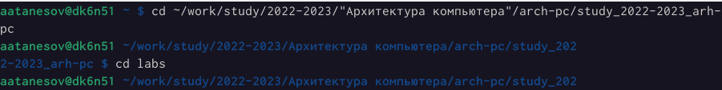
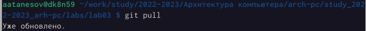
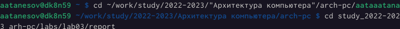
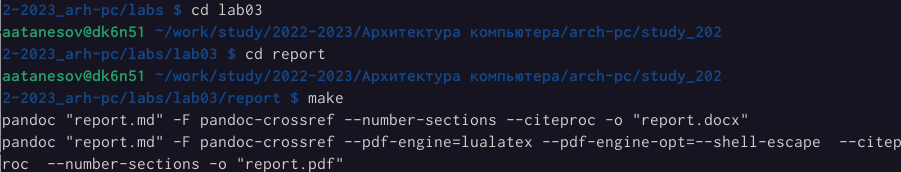
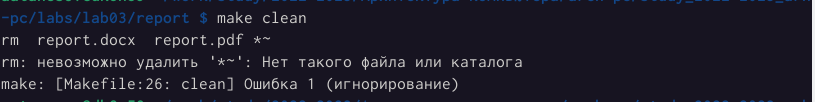

---
## Front matter
title: "Лабораторная работа №3"
subtitle: "Архитектура вычислительных систем"
author: "Атанесов Александр Николаевич"

## Generic otions
lang: ru-RU
toc-title: "Содержание"

## Bibliography
bibliography: bib/cite.bib
csl: pandoc/csl/gost-r-7-0-5-2008-numeric.csl

## Pdf output format
toc: true # Table of contents
toc-depth: 2
lof: true # List of figures
lot: true # List of tables
fontsize: 12pt
linestretch: 1.5
papersize: a4
documentclass: scrreprt
## I18n polyglossia
polyglossia-lang:
  name: russian
  options:
	- spelling=modern
	- babelshorthands=true
polyglossia-otherlangs:
  name: english
## I18n babel
babel-lang: russian
babel-otherlangs: english
## Fonts
mainfont: PT Serif
romanfont: PT Serif
sansfont: PT Sans
monofont: PT Mono
mainfontoptions: Ligatures=TeX
romanfontoptions: Ligatures=TeX
sansfontoptions: Ligatures=TeX,Scale=MatchLowercase
monofontoptions: Scale=MatchLowercase,Scale=0.9
## Biblatex
biblatex: true
biblio-style: "gost-numeric"
biblatexoptions:
  - parentracker=true
  - backend=biber
  - hyperref=auto
  - language=auto
  - autolang=other*
  - citestyle=gost-numeric
## Pandoc-crossref LaTeX customization
figureTitle: "Рис."
tableTitle: "Таблица"
listingTitle: "Листинг"
lofTitle: "Список иллюстраций"
lotTitle: "Список таблиц"
lolTitle: "Листинги"
## Misc options
indent: true
header-includes:
  - \usepackage{indentfirst}
  - \usepackage{float} # keep figures where there are in the text
  - \floatplacement{figure}{H} # keep figures where there are in the text
---

# Цель работы

Научиться использовать Markdown(облегчённый язык разметки, созданный с целью обозначения форматирования в простом тексте, с максимальным сохранением его читаемости человеком, и пригодный для машинного преобразования в языки для продвинутых публикаций),

# Задание

1. В соответствующем каталоге сделать отчёт по лабораторной работе №3 в формате Markdown. В качестве отчёта необходимо предоставить отчёты в 3 форматах: pdf,docx и  md.
2. Загрузить файлы на Github.

# Теоретическое введение

Здесь описываются теоретические аспекты, связанные с выполнением работы.

Например, в табл. [-@tbl:std-dir] приведено краткое описание стандартных каталогов Unix.

: Описание некоторых каталогов файловой системы GNU Linux {#tbl:std-dir}

| Имя каталога | Описание каталога                                                                                                          |
|--------------|----------------------------------------------------------------------------------------------------------------------------|
| `/`          | Корневая директория, содержащая всю файловую                                                                               |
| `/bin `      | Основные системные утилиты, необходимые как в однопользовательском режиме, так и при обычной работе всем пользователям     |
| `/etc`       | Общесистемные конфигурационные файлы и файлы конфигурации установленных программ                                           |
| `/home`      | Содержит домашние директории пользователей, которые, в свою очередь, содержат персональные настройки и данные пользователя |
| `/media`     | Точки монтирования для сменных носителей                                                                                   |
| `/root`      | Домашняя директория пользователя  `root`                                                                                   |
| `/tmp`       | Временные файлы                                                                                                            |
| `/usr`       | Вторичная иерархия для данных пользователя                                                                                 |

Более подробно об Unix см. в [@gnu-doc:bash;@newham:2005:bash;@zarrelli:2017:bash;@robbins:2013:bash;@tannenbaum:arch-pc:ru;@tannenbaum:modern-os:ru].

# Выполнение лабораторной работы

Описываются проведённые действия, в качестве иллюстрации даётся ссылка на иллюстрацию (рис. [-@fig:001])

1)Перейдём в каталог с шаблоном отчёта по лабораторной работе №3:

{ #fig:001 width=90% }

Описываются проведённые действия, в качестве иллюстрации даётся ссылка на иллюстрацию (рис. [-@fig:002])

2)Обновляю локальный репозиторий , скачав изменения командой (git pull):
 
 { #fig:002 width=90% }
 
 Описываются проведённые действия, в качестве иллюстрации даётся ссылка на иллюстрацию (рис. [-@fig:003])
 
 3)Переходим в папку report.
 
 { #fig:003 width=90% }
 
 Описываются проведённые действия, в качестве иллюстрации даётся ссылка на иллюстрацию (рис. [-@fig:004])
 
 4)Проведём компиляцию шаблона используя "Makefile" ,командой make.
 
 { #fig:004 width=90% }
 
  Описываются проведённые действия, в качестве иллюстрации даётся ссылка на иллюстрацию (рис. [-@fig:005])
  
 5) Удалю получившиеся файлы(report.pdf и report.docx) используя make clean.
 
 { #fig:005 width=90% }
 
 Описываются проведённые действия, в качестве иллюстрации даётся ссылка на иллюстрацию (рис. [-@fig:006])
 
 6) Открываю файл report.md, командой gedit,( открывается текстовой редактор gedit ).
 
  { #fig:006 width=90% }
 
 7) Заполняю отчёт о выполнении работы и скомпилирую его с помощью Makefile. Перемещаю скриншоты работы в подкаталог image. 
 
 8) Загружаю все изменения в репозиторий Github(a)
# Выводы

В ходе лабораторной работы я освоил процедуру оформления отчётов с помощью языка разметки-Markdown.

::: {#refs}
:::
